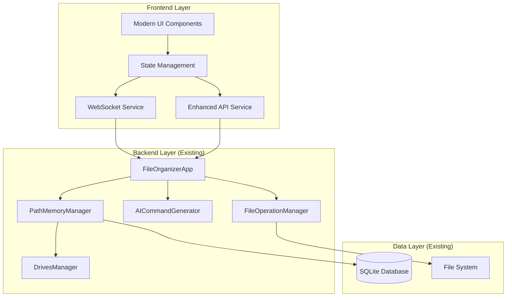

# Design Document

## Overview

This design document outlines the architecture and implementation approach for creating a modern, intuitive, and visually appealing frontend for the Homie File Organizer module. The design focuses on enhancing user experience while maintaining full compatibility with the existing Python backend infrastructure.
will
The new frontend  transform the current functional but basic interface into a polished, professional application that makes AI-powered file organization feel effortless and enjoyable. The design emphasizes visual hierarchy, smooth interactions, real-time feedback, and intelligent user assistance.

## Architecture

### High-Level Architecture



### Frontend Architecture Layers

1. **Presentation Layer**: Modern UI components with Material Design 3
2. **State Management Layer**: Centralized state using Provider/Riverpod
3. **Service Layer**: Enhanced API and WebSocket services
4. **Data Layer**: Models and repositories for data handling

### Design Principles

- **Progressive Enhancement**: Build upon existing functionality
- **Responsive Design**: Seamless experience across Windows, macOS, Linux, iOS, and Android platforms
- **Real-time Updates**: Live feedback and status updates
- **Accessibility First**: WCAG 2.1 AA compliance
- **Performance Optimized**: Smooth animations and efficient rendering

## Components and Interfaces

### Core UI Components

#### 1. Modern File Browser Component
```dart
class ModernFileBrowser extends StatefulWidget {
  final String initialPath;
  final Function(String) onPathSelected;
  final bool showHidden;
  final List<String> allowedExtensions;
}
```

**Features:**
- Native-style file/folder browser with breadcrumb navigation
- Quick access to recent folders and bookmarks
- Auto-completion for path input
- Drag-and-drop support for desktop platforms
- Thumbnail previews for images and documents
- File metadata display (size, modified date, type)

#### 2. Enhanced Drive Monitor Widget
```dart
class EnhancedDriveMonitor extends StatefulWidget {
  final Function(DriveInfo) onDriveSelected;
  final bool showAutoRefresh;
  final Duration refreshInterval;
}
```

**Features:**
- Real-time drive detection with visual indicators
- Drive health and space usage visualization
- Historical usage patterns and suggestions
- USB drive recognition with memory
- Quick action buttons for common operations

#### 3. AI Operations Preview Panel
```dart
class AIOperationsPreview extends StatefulWidget {
  final List<FileOperation> operations;
  final Function(List<FileOperation>) onOperationsModified;
  final Function() onExecute;
}
```

**Features:**
- Interactive operation cards with expand/collapse
- Individual operation approval/rejection
- Batch operation controls
- AI reasoning display with confidence scores
- Before/after preview visualization
- Estimated time and space impact

#### 4. Real-time Progress Tracker
```dart
class ProgressTracker extends StatefulWidget {
  final Stream<ProgressUpdate> progressStream;
  final Function() onPause;
  final Function() onCancel;
}
```

**Features:**
- Overall progress with individual file status
- Real-time speed and ETA calculations
- Error handling with retry options
- Pause/resume functionality
- Detailed operation logs

#### 5. Intelligent Organization Assistant
```dart
class OrganizationAssistant extends StatefulWidget {
  final String sourcePath;
  final Function(OrganizationPreset) onPresetSelected;
  final Function(String) onCustomIntent;
}
```

**Features:**
- Smart preset suggestions based on folder content
- Custom intent builder with AI assistance
- Historical pattern recognition
- Organization rule management
- Learning from user preferences

#### 6. File Insights Dashboard
```dart
class FileInsightsDashboard extends StatefulWidget {
  final String folderPath;
  final Map<String, dynamic> analyticsData;
}
```

**Features:**
- File type distribution charts
- Storage usage analysis
- Duplicate file detection
- Large file identification
- Organization recommendations
- Before/after comparisons

#### 7. Enhanced Organization Selector ✅ COMPLETED
```dart
class EnhancedOrganizationSelector extends StatefulWidget {
  final String? sourcePath;
  final Function(OrganizationStyle)? onStyleChanged;
  final Function(String)? onCustomIntentChanged;
  final bool showAdvancedOptions;
}
```

**Features:**
- **Visual Style Cards**: Rich cards with icons, descriptions, and examples for each organization style
- **AI-Powered Suggestions**: Context-aware suggestions based on folder content and user history
- **Preset Management**: Save/load organization patterns with full CRUD operations
- **Organization History**: Track and reuse successful organization patterns with usage statistics
- **Smooth Animations**: Fade transitions and responsive interactions
- **Advanced Custom Intent**: Intelligent text input with auto-completion and pattern recognition

**Organization Styles:**
- **Smart Categories**: AI analyzes files for intelligent categorization
- **By File Type**: Groups files by extension (pdf, mp4, jpg, etc.)
- **By Date**: Organizes by creation/modification date with year/month structure
- **Custom Organization**: User-defined patterns with AI assistance

**History & Preset Features:**
- **Pattern Memory**: Remembers successful organization configurations
- **One-Click Apply**: Instantly reuse previous patterns
- **History-to-Preset**: Convert successful patterns into permanent presets
- **Usage Analytics**: Track pattern effectiveness and file counts
- **Smart Suggestions**: AI learns from user behavior to suggest optimal patterns

### Enhanced State Management

#### File Organizer State Provider
```dart
class FileOrganizerProvider extends ChangeNotifier {
  // Core state
  String _sourcePath = '';
  String _destinationPath = '';
  OrganizationStyle _organizationStyle = OrganizationStyle.smartCategories;
  String _customIntent = '';
  
  // Operation state
  List<FileOperation> _operations = [];
  List<OperationResult> _results = [];
  OperationStatus _status = OperationStatus.idle;
  
  // Drive state
  List<DriveInfo> _drives = [];
  DriveInfo? _selectedDrive;
  
  // Analytics state
  FolderAnalytics? _analytics;
  List<OrganizationPreset> _presets = [];
  
  // Methods for state management
  Future<void> analyzeFolder();
  Future<void> executeOperations();
  Future<void> refreshDrives();
  Future<void> loadAnalytics();
}
```

#### WebSocket Integration Provider
```dart
class WebSocketProvider extends ChangeNotifier {
  late WebSocketService _wsService;
  ConnectionStatus _status = ConnectionStatus.disconnected;
  
  // Real-time event handling
  void _handleDriveUpdate(Map<String, dynamic> data);
  void _handleOperationProgress(Map<String, dynamic> data);
  void _handleError(Map<String, dynamic> data);
}
```

### Enhanced API Service

#### Modernized API Methods
```dart
class EnhancedApiService extends ApiService {
  // File browser methods
  Future<List<FileSystemEntity>> browsePath(String path);
  Future<List<String>> getRecentPaths();
  Future<List<String>> getBookmarkedPaths();
  Future<void> addBookmark(String path);
  
  // Enhanced analysis methods
  Future<AnalysisResult> analyzeWithPreview(AnalysisRequest request);
  Future<List<OrganizationPreset>> getSmartPresets(String path);
  Future<FolderAnalytics> getFolderInsights(String path);
  
  // Progress tracking methods
  Stream<ProgressUpdate> getProgressStream();
  Future<void> pauseOperations();
  Future<void> resumeOperations();
  Future<void> cancelOperations();
  
  // Learning methods
  Future<void> recordUserPreference(UserPreference preference);
  Future<List<OrganizationSuggestion>> getPersonalizedSuggestions();
}
```

## Data Models

### Enhanced Data Models

#### File Operation Model
```dart
class FileOperation {
  final String id;
  final OperationType type;
  final String sourcePath;
  final String? destinationPath;
  final String? newFolderName;
  final double confidence;
  final String reasoning;
  final List<String> tags;
  final DateTime estimatedTime;
  final int estimatedSize;
  bool isApproved;
  bool isRejected;
  String? userNote;
}

enum OperationType { move, copy, delete, rename, createFolder }
```

#### Drive Information Model
```dart
class DriveInfo {
  final String path;
  final String name;
  final String type; // USB, HDD, SSD, Network
  final int totalSpace;
  final int freeSpace;
  final bool isConnected;
  final DateTime? lastSeen;
  final List<String> commonFolders;
  final Map<String, int> fileTypeDistribution;
  final DriveHealth health;
}

enum DriveHealth { excellent, good, warning, critical }
```

#### Organization Preset Model
```dart
class OrganizationPreset {
  final String id;
  final String name;
  final String description;
  final String intent;
  final List<String> applicableFileTypes;
  final Map<String, String> folderStructure;
  final double relevanceScore;
  final bool isCustom;
  final DateTime createdAt;
  final int usageCount;
}
```

#### Folder Analytics Model
```dart
class FolderAnalytics {
  final String path;
  final int totalFiles;
  final int totalFolders;
  final int totalSize;
  final Map<String, int> fileTypeDistribution;
  final List<FileInfo> largestFiles;
  final List<DuplicateGroup> duplicates;
  final List<String> emptyFolders;
  final Map<String, int> fileAgeDistribution;
  final List<OrganizationSuggestion> suggestions;
  final DateTime analyzedAt;
}
```

#### Progress Update Model
```dart
class ProgressUpdate {
  final String operationId;
  final int completedOperations;
  final int totalOperations;
  final double percentage;
  final String currentFile;
  final Duration elapsed;
  final Duration? estimated;
  final int filesPerSecond;
  final List<String> recentErrors;
  final OperationStatus status;
}

enum OperationStatus { idle, analyzing, executing, paused, completed, error }
```

## Error Handling

### Comprehensive Error Management

#### Error Types and Handling
```dart
abstract class FileOrganizerError {
  final String message;
  final String code;
  final DateTime timestamp;
  final Map<String, dynamic>? context;
}

class NetworkError extends FileOrganizerError {
  // Backend connection issues
}

class FileSystemError extends FileOrganizerError {
  // File access, permission issues
}

class ValidationError extends FileOrganizerError {
  // Input validation failures
}

class AIAnalysisError extends FileOrganizerError {
  // AI service failures
}
```

#### Error Recovery Strategies
- **Automatic Retry**: Network and temporary errors
- **User Guidance**: Clear error messages with solutions
- **Graceful Degradation**: Fallback to basic functionality
- **Error Reporting**: Optional error reporting for improvements

### User-Friendly Error Messages
```dart
class ErrorMessageProvider {
  static String getHumanReadableMessage(FileOrganizerError error) {
    switch (error.runtimeType) {
      case NetworkError:
        return "Can't connect to the backend. Please check if the server is running.";
      case FileSystemError:
        return "Unable to access the file. Please check permissions and try again.";
      case ValidationError:
        return "Please check your input and try again.";
      default:
        return "Something went wrong. Please try again.";
    }
  }
}
```

## Testing Strategy

### Testing Pyramid

#### Unit Tests (70%)
- **Component Tests**: Individual UI component behavior
- **State Management Tests**: Provider state changes and business logic
- **Service Tests**: API service methods and error handling
- **Model Tests**: Data model validation and serialization

#### Integration Tests (20%)
- **API Integration**: Backend communication and data flow
- **WebSocket Integration**: Real-time updates and connection handling
- **File System Integration**: File browser and path handling
- **Cross-Platform Integration**: Windows, macOS, Linux, iOS, and Android specific functionality

#### End-to-End Tests (10%)
- **Complete Workflows**: Full file organization scenarios
- **User Journey Tests**: Critical user paths and interactions
- **Performance Tests**: Large file sets and stress testing
- **Accessibility Tests**: Screen reader and keyboard navigation

### Testing Tools and Framework

#### Flutter Testing Setup
```dart
// Widget testing with golden tests
testWidgets('ModernFileBrowser displays correctly', (tester) async {
  await tester.pumpWidget(createTestApp(ModernFileBrowser()));
  await expectLater(find.byType(ModernFileBrowser), matchesGoldenFile('file_browser.png'));
});

// State management testing
test('FileOrganizerProvider analyzes folder correctly', () async {
  final provider = FileOrganizerProvider();
  await provider.analyzeFolder('/test/path');
  expect(provider.operations.length, greaterThan(0));
});

// API service mocking
class MockApiService extends Mock implements EnhancedApiService {}
```

#### Accessibility Testing
```dart
testWidgets('File browser is accessible', (tester) async {
  await tester.pumpWidget(createTestApp(ModernFileBrowser()));
  
  // Test semantic labels
  expect(find.bySemanticsLabel('Select folder'), findsOneWidget);
  
  // Test keyboard navigation
  await tester.sendKeyEvent(LogicalKeyboardKey.tab);
  expect(tester.binding.focusManager.primaryFocus, isNotNull);
});
```

### Performance Testing

#### Metrics to Track
- **Rendering Performance**: 60 FPS maintenance during animations
- **Memory Usage**: Efficient memory management for large file lists
- **Network Performance**: API response times and error rates
- **File Operation Speed**: Throughput for file operations

#### Performance Benchmarks
```dart
test('File list renders efficiently with 10k items', () async {
  final stopwatch = Stopwatch()..start();
  await tester.pumpWidget(createFileListWith10kItems());
  stopwatch.stop();
  
  expect(stopwatch.elapsedMilliseconds, lessThan(100));
});
```

## Implementation Phases

### Phase 1: Foundation (Week 1-2)
- **Enhanced State Management**: Implement comprehensive providers
- **Modern UI Components**: Create base component library
- **Improved API Service**: Enhance existing API with new methods
- **Basic File Browser**: Implement native-style file selection

### Phase 2: Core Features (Week 3-4)
- **AI Operations Preview**: Interactive operation management
- **Real-time Progress**: Live operation tracking
- **Drive Monitoring**: Enhanced drive detection and management
- **Error Handling**: Comprehensive error management system

### Phase 3: Intelligence (Week 5-6)
- **Organization Assistant**: Smart presets and suggestions
- **File Insights**: Analytics and recommendations
- **Learning System**: User preference tracking
- **Custom Presets**: User-defined organization rules

### Phase 4: Polish (Week 7-8)
- **Animations and Transitions**: Smooth UI interactions
- **Accessibility Features**: Full WCAG 2.1 AA compliance
- **Performance Optimization**: Efficient rendering and memory usage
- **Cross-Platform Testing**: Ensure consistent experience

### Phase 5: Advanced Features (Week 9-10)
- **Keyboard Shortcuts**: Power user functionality
- **Drag and Drop**: Intuitive file manipulation
- **Batch Operations**: Multi-file selection and operations
- **Advanced Analytics**: Detailed insights and reporting

## Platform Considerations

### Desktop Platforms (Windows, macOS, Linux)
- **Native File Dialogs**: Platform-appropriate file selection
- **System Integration**: Taskbar progress and notifications
- **Keyboard Shortcuts**: Desktop-standard key combinations
- **Window Management**: Proper window sizing and state
- **Drag and Drop**: Native desktop drag-and-drop support

### Mobile Platforms (iOS, Android)
- **Touch Interactions**: Gesture-based navigation
- **File Picker Integration**: Native mobile file selection
- **Responsive Layout**: Mobile-optimized interface
- **Performance Optimization**: Efficient rendering on mobile devices
- **Platform Integration**: Native sharing and file management integration

### Cross-Platform Consistency
- **Unified Experience**: Consistent UI/UX across all supported platforms
- **Platform Conventions**: Respect each platform's design guidelines
- **Native Integration**: Use platform-specific APIs when available

## Security Considerations

### Data Protection
- **Path Validation**: Prevent directory traversal attacks
- **Input Sanitization**: Validate all user inputs
- **Secure Communication**: HTTPS/WSS for production
- **Error Information**: Avoid exposing sensitive data in errors

### User Privacy
- **Local Processing**: Keep file analysis local when possible
- **Minimal Data Transfer**: Only send necessary metadata to AI
- **User Consent**: Clear privacy policy and data usage
- **Data Retention**: Configurable data retention policies

## Accessibility Features

### WCAG 2.1 AA Compliance
- **Keyboard Navigation**: Full keyboard accessibility
- **Screen Reader Support**: Proper ARIA labels and roles
- **Color Contrast**: Minimum 4.5:1 contrast ratio
- **Focus Management**: Clear focus indicators and logical order

### Inclusive Design
- **High Contrast Mode**: Alternative color schemes
- **Font Size Options**: Configurable text sizing
- **Motion Preferences**: Respect reduced motion settings
- **Alternative Text**: Descriptive alt text for all images

### Assistive Technology
- **Voice Control**: Voice navigation support
- **Switch Navigation**: Support for switch devices
- **Magnification**: Proper scaling and zoom support
- **Custom Shortcuts**: Configurable keyboard shortcuts